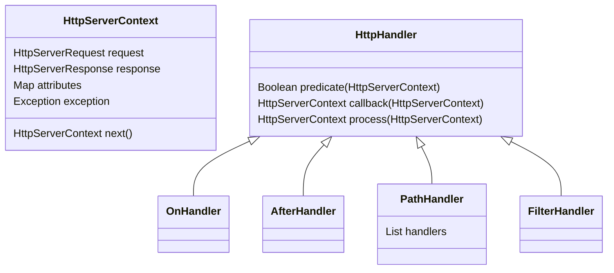

# Module http_handlers
This port's purpose is to develop HTTP servers (REST services or Web applications). It defines a DSL
to declare HTTP request handlers.

Adapters implementing this port are in charge of processing HTTP requests through a list of
handlers.

## Install the Dependency
This module is not meant to be used directly. It is used by HTTP client and HTTP server modules.

## HTTP Routing Documentation (TODO)
* Filters/callbacks definitions and how they can be combined
* Design makes easy to test routing, not only callbacks
* Functional approach design (immutability, no side effects)



# HTTP Context
These are the events that the handlers handle (they are also called HTTP calls or just calls along
this documentation). They wrap HTTP requests and responses along with some attributes that may be
used to pass data across handlers or to signal that a previous callback resulted in an error.

The HTTP context provides you with everything you need to handle an HTTP request. It contains the
request, the response, and a bunch of utility methods to return results, read parameters or pass
attributes among handlers.

The methods are available directly from the callback. You can check the [API documentation] for the
full list of methods. This sample code illustrates the usage:

@code http/http_test/main/examples/SamplesTest.kt?callbackCall

[API documentation]: ../api/http/http_handlers/com.hexagontk.http.handlers/-http-context

# Handlers
The main building blocks of Hexagon HTTP services are a set of handlers. A handler is made up of two
simple pieces:

* A **predicate**: which decides if the handler should be executed for a given request.
* A **callback**: code that receives an HTTP context and returns another (or the same) context.

IMPORTANT: the order in which handlers are declared is NOT the order, it is the depth. Handlers are
not linked, they are NESTED. The [next()][next] method passes control to the next level. If
[next()][next] is not called in a Handler, following Handlers WON'T be executed (However, the
"after" part of already executed Handlers will be run).

For example, this definition:

```
H1
H2
H3
```

Is really this execution:

```
H1 (on)
  H2 (on)
    H3 (on)
  H2 (after)
H1 (after)
```

Check the next snippet for Handlers usage examples:

@code http/http_test/main/examples/SamplesTest.kt?routesCreation

[next]: ../api/http/http_handlers/com.hexagontk.http.handlers/-http-context

<!-- TODO Start document review -->

# Handler Predicates
A predicate is a function that is applied to a call context and returns a boolean. If the result is
true, the handler will be executed.

The default implementation ([HttpPredicate]) is based on a template with any combination of
the following fields:

* a list of HTTP methods
* a path pattern
* an exception
* a status

It yields true if all the supplied fields matches a call context.

[HttpPredicate]: ../api/http/http_handlers/com.hexagontk.http.handlers/-http-predicate

## Path Patterns
Patterns to match requests paths. They can have:

* Variables: `/path/{param}`
* Wildcards: `/*/path`
* Regular expresión subset: `/(this|that)/path`

# Handler Types

## On Handlers
* Predicate evaluated at start
* Executed at the start (before the 'next' handler is called)

## After Handlers
* Predicate evaluated at end (checked on the coming back of the execution next handler)
* Executed at the end (after 'next' handler has returned)

## Filters
You might know filters as interceptors, or middleware from other libraries. Filters are blocks of
code executed before and/or after other handlers. They can read the request, read/modify the
response, and call the remaining handlers or skip them to halt the call processing.

All filters that match a route are executed in the order they are declared.

Filters optionally take a pattern, causing them to be executed only if the request path matches
that pattern.

The following code details filters usage:

@code http/http_test/main/examples/SamplesTest.kt?filters

## Path Handlers
Handlers can be grouped by calling the `path()` method, which takes a String prefix and gives you a
scope to declare other handlers. Ie:

@code http/http_test/main/examples/SamplesTest.kt?routeGroups

If you have a lot of routes, it can be helpful to group them into Path Handlers. You can create path
handlers to mount a group of routes in different paths (allowing you to reuse them). Check this
snippet:

@code http/http_test/main/examples/SamplesTest.kt?routers

# Handler Callbacks
Callbacks are request's handling blocks that are bound to handlers. They make the request and
response objects available to the handling code.

Callbacks produce a result by returning the received HTTP context with a different response.
Callbacks results are the input for the next handler's callbacks in the pipeline.

## Request
Request functionality is provided by the `request` field:

@code http/http_test/main/examples/SamplesTest.kt?callbackRequest

## Path Parameters
Route patterns can include named parameters, accessible via the `pathParameters` map on the request
object:

Path parameters can be accessed by name or by index.

@code http/http_test/main/examples/SamplesTest.kt?callbackPathParam

## Query Parameters
It is possible to access the whole query string or only a specific query parameter using the
`parameters` map on the `request` object:

@code http/http_test/main/examples/SamplesTest.kt?callbackQueryParam

## Form Parameters
HTML Form processing. Don't parse body!

@code http/http_test/main/examples/SamplesTest.kt?callbackFormParam

## File Uploads
Multipart Requests

@code http/http_test/main/examples/MultipartSamplesTest.kt?callbackFile

## Response
Response information is provided by the `response` field:

@code http/http_test/main/examples/SamplesTest.kt?callbackResponse

To send error responses:

@code http/http_test/main/examples/SamplesTest.kt?callbackHalt

## Redirects
You can redirect requests (returning 30x codes) by using `Call` utility methods:

@code http/http_test/main/examples/SamplesTest.kt?callbackRedirect

## Cookies
The request and response cookie functions provide a convenient way for sharing information between
handlers, requests, or even servers.

You can read client sent cookies from the request's `cookies` read only map. To change cookies or
add new ones you have to use `response.addCookie()` and `response.removeCookie()` methods.

Check the following sample code for details:

@code http/http_test/main/examples/SamplesTest.kt?callbackCookie

<!-- TODO End -->

# Error Handling
You can provide handlers for runtime errors. Errors are unhandled exceptions in the callbacks, or
handlers returning error codes.

## Exception Mapping
You can handle previously thrown exceptions of a given type (or subtype). The handler allows you to
refer to the thrown exception. Look at the following code for a detailed example:

@code http/http_test/main/examples/SamplesTest.kt?exceptions

# Static Files
You can use a [FileCallback] or a [UrlCallback] to route requests to files or classpath resources.

Those callbacks can point to folders or to files. If they point to a folder, the pattern should
have a parameter to provide the file to be fetched inside the folder.

Check the next example for details:

@code http/http_test/main/examples/SamplesTest.kt?files

## Media Types
The media types of static files are computed from the file extension using the utility methods of
the [com.hexagontk.core.media] package.

[com.hexagontk.core.media]: ../api/core/com.hexagontk.core.media

# WebSockets
A Web Socket is an HTTP(S) connection made with the GET method and the `upgrade: websocket` and
`connection: upgrade` headers.

If the server is handling HTTPS connections, the client should use
the WSS protocol.

When the server receives such a request, it is handled as any other route, and if everything is ok
the connection is converted to a permanent full duplex socket.

If the HTTP request is correct, callbacks should be supplied to handle WS events. Otherwise, if
standard HTTP errors are returned, the connection is closed. This gives the programmer an
opportunity to check the request format or authorization.

Once the WS session is created (after checking the upgrade request is correct), the upgrade request
data can be accessed inside the WS session.

Sessions connected to the same WS endpoint can be stored to broadcast messages.

Ping and pong allows to maintain connection opened.

@code http/http_test/main/examples/WebSocketsTest.kt?ws_server

# Testing

## Mocking Calls
To unit test callbacks and handlers you can create test calls with hardcoded requests without
relying on mocking libraries.

For a quick example, check the snipped below:

@code http/http_test/main/examples/SamplesTest.kt?mockRequest

# Package com.hexagontk.http.handlers
This package defines server interfaces for HTTP server adapters.
