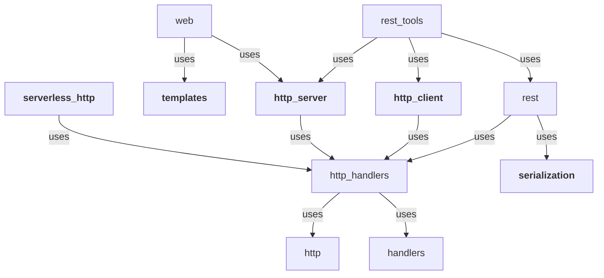

The Hexagon Toolkit provides several libraries to build server applications. These libraries provide
single standalone features and are referred to as ["Ports"][Ports and Adapters Architecture].

The main ports are:

* [The HTTP server]: supports HTTPS, HTTP/2, WebSockets, mutual TLS, static files (serve and
  upload), forms processing, cookies, CORS and more.
* [The HTTP client]: which supports mutual TLS, HTTP/2, WebSockets, cookies, form fields and files
  among other features.
* [Serialization]: provides a common way of using different data formats. Data formats are pluggable
  and are handled in the same way regardless of their library.
* [Template Processing]: allows template processing from URLs (local files, resources or HTTP
  content) binding name patterns to different engines.

Each of these features or ports may have different implementations called
["Adapters"][Ports and Adapters Architecture].

Hexagon is designed to fit in applications that conform to the [Hexagonal Architecture] (also called
[Clean Architecture], [Onion Architecture] or [Ports and Adapters Architecture]). Its design
principles also fit into this architecture.

[The HTTP server]: http_server.md
[The HTTP client]: http_client.md
[Serialization]: serialization.md
[Template Processing]: templates.md
[Hexagonal Architecture]: http://fideloper.com/hexagonal-architecture
[Clean Architecture]: https://8thlight.com/blog/uncle-bob/2012/08/13/the-clean-architecture.html
[Onion Architecture]: https://dzone.com/articles/onion-architecture-is-interesting
[Ports and Adapters Architecture]: https://herbertograca.com/2017/09/14/ports-adapters-architecture

# Hello World
Simple Hello World HTTP example.

@code http/http_server_jetty/src/test/kotlin/com/hexagontk/http/server/jetty/HelloWorldTest.kt?hello_world

You can check the [code examples] and [demo projects] for more complex use cases.

[code examples]: examples/http_server_examples.md
[demo projects]: examples/example_projects.md

# Features
Hexagon's goals and design principles:

* **Put you in Charge**: There is no code generation, no runtime annotation processing, no classpath
  based logic, and no implicit behaviour. You control your tools, not the other way around.

* **Modular**: Each feature (Port) or adapter is isolated in its own module. Use only the modules
  you need without carrying unneeded dependencies.

* **Pluggable Adapters**: Every Port may have many implementations (Adapters) using different
  technologies. You can swap adapters without changing the application code.

* **Batteries Included**: It contains all the required pieces to make production-grade applications:
  logging utilities, serialization, resource handling and build helpers.

* **Native Image**: most of the toolkit libraries include GraalVM metadata (check the [libraries
  catalog]), native tests are run on CI to ensure native images can be built out of the box.

* **Properly Tested**: The project's coverage is checked in every Pull Request. It is also
  stress-tested at [TechEmpower Frameworks Benchmark][benchmark].

[benchmark]: https://www.techempower.com/benchmarks
[libraries catalog]: https://www.graalvm.org/native-image/libraries-and-frameworks

# Concepts

## Port
It is an interface for a task. The toolkit ports are designed to work on their own. For example: you
can use the [http_server] module without importing the [templates] one, and the other way around
(taking only the dependencies you need for your application).

Each Port may have different implementations (Adapters).

Ports cannot be used by themselves and in their place, an adapter implementing them should be added
to the list of dependencies.

## Adapter
They are implementations of a functionality (Port) for a given product/technology. Clients should
only use ports' code (not Adapters specific code), this makes them easy to switch among different
adapters with minimum impact.

Adapters are independent of each other, and you can use several adapters for the same port in a
single application. For example, you could use many Template adapters to support several template
engines.

[http_client_jetty], and [http_server_jetty] are examples of this type of module. Adapter names must
start with their Port name.

## Composite Port
These modules provide functionality on top of a set of ports (combining them) but without relying on
any specific adapters. An example would be the [Web] module that uses [http_server] and
[template][Template Processing] Ports, but leaves clients the decision of picking the adapters they
want.

## Library
Module that provide functionality that does not depend on different implementations, like [core] and
[handlers].

## Manager
Singleton object to manage a cross toolkit aspect. I.e., Serialization or Templates.

[core]: core.md
[handlers]: handlers.md

[http_server]: http_server.md
[templates]: templates.md

[http_client_jetty]: http_client_jetty.md
[http_server_jetty]: http_server_jetty.md

# Hexagon Extras
The libraries inside the [hexagon_extra] repository provide extra features. They may be useful to
develop applications, but not strictly required. Some of these modules are:

* Schedulers: Provides repeated tasks execution based on [Cron] expressions.
* Models: Contain classes that model common data objects.
* Args: Command line arguments definition and parsing.

[hexagon_extra]: https://github.com/hexagontk/hexagon_extra
[Web]: web.md
[Cron]: https://en.wikipedia.org/wiki/Cron

# Architecture
How Hexagon fits in your architecture in a picture.

> ✏️ **Note**
>
> Using this toolkit won't make your application compliant with Hexagonal Architecture (by its
> nature, no tool can do that), you have to provide a layer of abstraction by yourself.

# Ports
Ports with their provided implementations (Adapters).

| PORT                    | ADAPTERS                                              |
|-------------------------|-------------------------------------------------------|
| [HTTP Server]           | [Netty], [Netty Epoll], [Jetty], [Servlet], [Helidon] |
| [HTTP Client]           | [Java][Java Client], [Jetty][Jetty Client]            |
| [Templates]             | [Pebble], [FreeMarker], [Rocker], [jte]               |
| [Serialization Formats] | [JSON], [YAML], [CSV], [XML], [TOML]                  |

[HTTP Server]: http_server.md
[Netty]: http_server_netty.md
[Netty Epoll]: http_server_netty_epoll.md
[Jetty]: http_server_jetty.md
[Servlet]: http_server_servlet.md
[Helidon]: http_server_helidon.md
[HTTP Client]: http_client.md
[Java Client]: http_client_java.md
[Jetty Client]: http_client_jetty.md
[Templates]: templates.md
[Pebble]: templates_pebble.md
[FreeMarker]: templates_freemarker.md
[Rocker]: templates_rocker.md
[jte]: templates_jte.md
[Serialization Formats]: serialization.md
[JSON]: api/serialization/serialization_jackson_json/com.hexagontk.serialization.jackson.json/-json
[YAML]: api/serialization/serialization_jackson_yaml/com.hexagontk.serialization.jackson.yaml/-yaml
[CSV]: api/serialization/serialization_jackson_csv/com.hexagontk.serialization.jackson.csv/-csv
[XML]: api/serialization/serialization_jackson_xml/com.hexagontk.serialization.jackson.xml/-xml
[TOML]: api/serialization/serialization_jackson_toml/com.hexagontk.serialization.jackson.toml/-toml

# Module Dependencies
Module dependencies (including extra modules):

